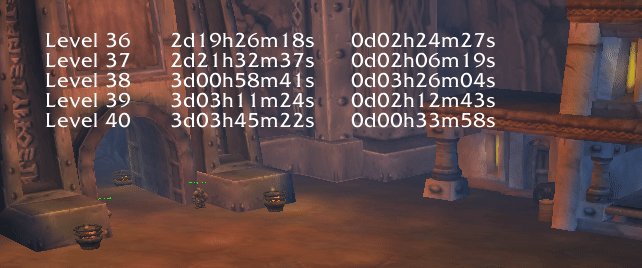
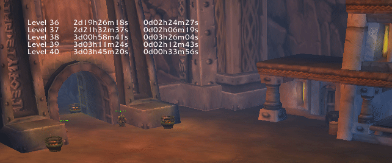
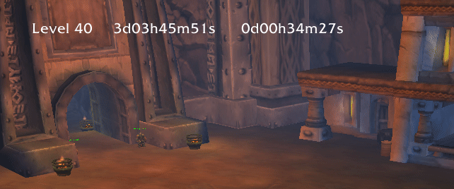
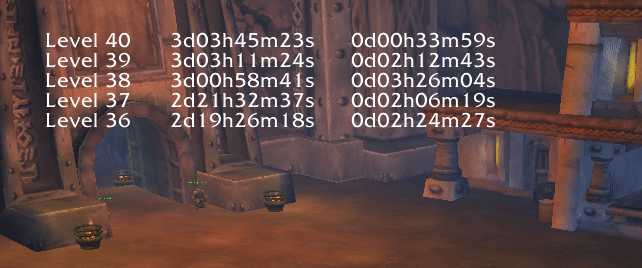
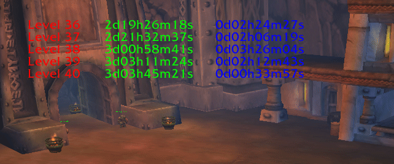
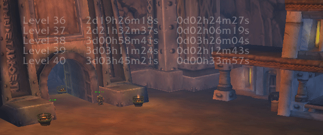
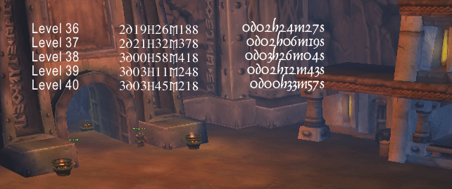
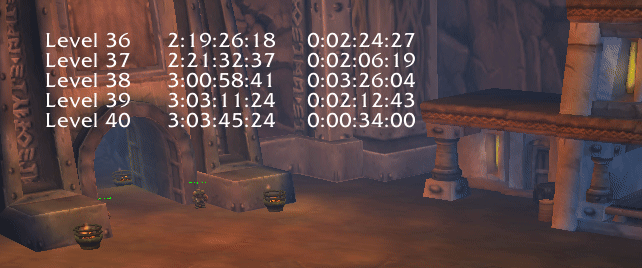

# LevelingStopwatch

Tested with World of Warcraft 1.12.1 (5875) Vanilla

## Features

Show leveling times

Vary font size

Decide number of lines to display

Reverse order

Choose any color

Set transparency

Use any font

Custom format string

## How to use

### Installation

Like most other addons, too, simply copy the files into the properly named folder in your World of Warcraft addons directory:

    ├── Interface
    │   └── AddOns
    │       ├── LevelingStopwatch
    │       │   ├── LevelingStopwatch.lua
    │       │   ├── LevelingStopwatch.toc
    │       │   ├── ...

### Save settings

Leveling timestamps and all other addon settings are stored on a per-character basis. There are no account-wide settings. The game saves addon data to disk on logout, exit, disconnect or reload of the user interface. This means you can manually save any changes by reloading the user interface:

    /run ReloadUI()

### Reset addon

To reset addon data:

    /run LevelingStopwatch=nil ReloadUI()

Warning: This resets *all* addon data, including saved timestamps for this character!

If you made a mistake while adjusting the overlay, and now it's hidden or something else went wrong, you might want to simply reset addon settings (*only* settings) to default values while preserving saved leveling timestamps:

    /run local s=LevelingStopwatch.levels LevelingStopwatch={levels=s} ReloadUI()

### Move position

You can move the overlay position by adjusting `frameAnchor` as well as `frameOffsetX` and `frameOffsetY`. For example, to move the frame by 100 pixels to the right and 200 pixels to the bottom (which is like moving it -200 pixels to the top), relative to the top left corner of the screen:

    /run LevelingStopwatch.frameAnchor="TOPLEFT" LevelingStopwatch.frameOffsetX=100 LevelingStopwatch.frameOffsetY=-200 ReloadUI()

### Change font size, color and opacity

Adjust text attributes like font size, color and opacity. To turn the text a little bigger, yellow and slightly transparent, for example:

    /run LevelingStopwatch.fontSize=16 LevelingStopwatch.textColor="ffff00" LevelingStopwatch.textOpacity=0.6 ReloadUI()

### Format timestamps

Example:

    /run LevelingStopwatch.formatString="%d:%02d:%02d:%02d" ReloadUI()

If you have set your text to align to the right, it can help to add a space character at the end of your format string to keep the text position more stable:

    /run LevelingStopwatch.formatString="%d:%02d:%02d:%02d " ReloadUI()

### Show only timestamps per level

If you want to hide the total timestamps, you can set the opacity of the middle text column to `0`, making it fully transparent. Furthermore, we anchor the rightmost column to the left of the now hidden column.

    /run LevelingStopwatch.textOpacity={[1]=1,[2]=0,[3]=1} LevelingStopwatch.columnAnchor={[2]="TOPRIGHT",[3]="TOPLEFT"} ReloadUI()

### Fixed column positions

If the font you're using isn't monospaced, and the text changes (because the current level time is incrementing), then the right-aligned column position might "wiggle" a little.

To fix that, you can either change `fontName` to a monospaced font. Or you can set fixed column positions:

    /run LevelingStopwatch.columnAnchor="TOPLEFT" LevelingStopwatch.columnOffsetX=200 ReloadUI()

Or even individual offsets per column:

    /run LevelingStopwatch.columnAnchor="TOPLEFT" LevelingStopwatch.columnOffsetX={[2]=150,[3]=200} ReloadUI()

## Reference documentation

### `frameAnchor`

Default value: `"TOPLEFT"`

Possible values: `"TOPLEFT"`, `"TOPRIGHT"` `"BOTTOMLEFT"`, `"BOTTOMRIGHT"`, `"TOP"`, `"BOTTOM"`, `"LEFT"`, `"RIGHT"`, `"CENTER"`

Frame alignment anchor.

### `frameOffsetX`

Default value: `20`

Possible values: any integer

Frame alignment offset in x-direction.

### `frameOffsetY`

Default value: `-100`

Possible values: any integer

Frame alignment offset in y-direction.

### `columnAnchor`

Default value: `"TOPRIGHT"`

Possible values: `"TOPLEFT"`, `"TOPRIGHT"` `"BOTTOMLEFT"`, `"BOTTOMRIGHT"`, `"TOP"`, `"BOTTOM"`, `"LEFT"`, `"RIGHT"`, `"CENTER"`

Column alignment anchor.

Note: If you want to set individual values for each column, use a table where a key-value pair represents the column number and respective value.

Note: Column alignment anchor for column 1 cannot be changed and will always be `"TOPLEFT"` relative to the frame.

### `columnOffsetX`

Default value: `20`

Possible values: any integer

Column alignment offset in x-direction.

Note: If you want to set individual values for each column, use a table where a key-value pair represents the column number and respective value.

Note: Column alignment offset for column 1 cannot be changed and will always be `0` relative to the frame.

### `columnOffsetY`

Default value: `0`

Possible values: any integer

Column alignment offset in y-direction.

Note: If you want to set individual values for each column, use a table where a key-value pair represents the column number and respective value.

Note: Column alignment offset for column 1 cannot be changed and will always be `0` relative to the frame.

### `textJustifyV`

Default value: `"TOP"`

Possible values: `"TOP"`, `"MIDDLE"`, `"BOTTOM"`

Text alignment in vertical direction.

Note: If you want to set individual values for each column, use a table where a key-value pair represents the column number and respective value.

### `textJustifyH`

Default value: `{[1] = "LEFT", [2] = "RIGHT", [3] = "RIGHT"}`

Possible values: `"LEFT"`, `"CENTER"`, `"RIGHT"`

Text alignment in horizontal direction.

Note: If you want to set individual values for each column, use a table where a key-value pair represents the column number and respective value.

### `fontName`

Default value: `""`

Text font. Any TTF or OTF font should work. Path is relative to World of Warcraft main directory. Remember to escape backslash characters. For example:

    /run LevelingStopwatch.fontName="Fonts\\MORPHEUS.ttf" ReloadUI()

Note: If you want to set individual values for each column, use a table where a key-value pair represents the column number and respective value.

### `fontSize`

Default value: `12`

Text font size.

Note: If you want to set individual values for each column, use a table where a key-value pair represents the column number and respective value.

### `textColor`

Default value: `"ffffff"`

Possible values: any string representing a six digit hexadecimal RGB triplet, like used for [web colors](https://en.wikipedia.org/wiki/Web_colors), but without leading hash symbol

Text color.

Note: If you want to set individual values for each column, use a table where a key-value pair represents the column number and respective value.

### `textOpacity`

Default value: `1.0`

Possible values: any float between 0.0 (invisible) and 1.0 (fully visible)

Text opacity.

Note: If you want to set individual values for each column, use a table where a key-value pair represents the column number and respective value.

### `formatString`

Default value: `"%dd%02dh%02dm%02ds"`

Possible values: valid format string for [`string.format`](https://www.lua.org/pil/20.html)

Format string for timestamps.

### `maxLines`

Default value: `5`

Possible values: any positive integer

Maximum number of lines.

### `reverseOrder`

Default value: `false`

Possible values: `true`, `false`

Reverse order of lines.

### `refreshFrequency`

Default value: `1`

Possible values: any positive number

Number of overlay refreshs per second.

### `levels`

Default value: `{}`

Contains the completion timestamps for each level. Each key-value pair represents the level and respective total time in seconds. Usually, there is no need to modify this setting, but you can use it to manually set level timestamps if you previously recorded them elsewhere.

For example, to set the timestamp for the completion of level 20 to 123456 seconds of total playing time:

    /run LevelingStopwatch.levels[20]=123456 ReloadUI()

To print all saved timestamps:

    /run local function p(t)DEFAULT_CHAT_FRAME:AddMessage(t)end p("Total game time in seconds when level completed:")for i=1,59 do local s=LevelingStopwatch.levels[i]if s~=nil then p("LevelingStopwatch.levels["..i.."]="..s)end end

### `characterName`

Default value: `UnitName("player")`

Saving character name for internal sanity check. Not meant to be modified.
